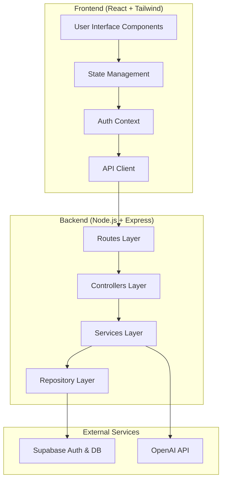

# Design Document

## Overview

The AI Interview Preparation Web App is a full-stack application built with modern web technologies following clean architecture principles. The system consists of a React frontend with Tailwind CSS for styling, a Node.js/Express backend API, Supabase for authentication and data persistence, and OpenAI API integration for intelligent question generation.

The architecture emphasizes separation of concerns, maintainability, and scalability. The frontend implements a component-based architecture with proper state management, while the backend follows RESTful API design patterns with clean architecture layers. All components integrate seamlessly to provide a comprehensive interview preparation experience.

## Architecture

### High-Level Architecture



### Clean Architecture Layers

**Frontend Architecture:**
- **Presentation Layer**: React components with Tailwind CSS styling
- **Application Layer**: Custom hooks, context providers, and state management
- **Infrastructure Layer**: API clients, authentication services, and external integrations

**Backend Architecture:**
- **Routes Layer**: Express route definitions and middleware
- **Controllers Layer**: Request/response handling and validation
- **Services Layer**: Business logic and orchestration
- **Repository Layer**: Data access and external service integration

### Technology Stack Integration

The application leverages each technology's strengths:
- **React**: Component-based UI with efficient state management
- **Tailwind CSS**: Utility-first styling for rapid development and consistency
- **Node.js/Express**: Lightweight, scalable backend with middleware support
- **Supabase**: Managed authentication, real-time database, and Row Level Security
- **OpenAI API**: Advanced language model for intelligent question generation

## Components and Interfaces

### Frontend Components

**Core UI Components:**
- `AuthForm`: Handles login/registration with Supabase integration
- `RoleSelector`: Multi-select interface for job roles
- `SkillSelector`: Dynamic skill selection based on chosen roles
- `QuestionGenerator`: Interface for triggering AI question generation
- `QuestionDisplay`: Renders generated questions with formatting
- `Dashboard`: Overview of interview history and progress
- `MockInterview`: Timed interview simulation interface
- `ProgressTracker`: Visual representation of preparation progress

**Layout Components:**
- `Header`: Navigation and user authentication status
- `Sidebar`: Quick access to main features
- `Layout`: Main application wrapper with responsive design
- `LoadingSpinner`: Consistent loading states across the app

**Utility Components:**
- `Button`: Reusable button with Tailwind variants
- `Input`: Form input with validation styling
- `Modal`: Overlay dialogs for confirmations and forms
- `Toast`: Notification system for user feedback

### Backend API Endpoints

**Authentication Endpoints:**
```
POST /api/auth/login
POST /api/auth/register
POST /api/auth/logout
GET  /api/auth/profile
```

**User Management Endpoints:**
```
GET    /api/users/profile
PUT    /api/users/profile
GET    /api/users/roles
PUT    /api/users/roles
GET    /api/users/skills
PUT    /api/users/skills
```

**Question Management Endpoints:**
```
POST   /api/questions/generate
GET    /api/questions/history
GET    /api/questions/:sessionId
DELETE /api/questions/:sessionId
```

**Interview Session Endpoints:**
```
POST   /api/interviews/start
PUT    /api/interviews/:sessionId/complete
GET    /api/interviews/history
GET    /api/interviews/:sessionId/results
```

### Service Interfaces

**Authentication Service:**
```typescript
interface AuthService {
  login(email: string, password: string): Promise<User>
  register(email: string, password: string): Promise<User>
  logout(): Promise<void>
  getCurrentUser(): Promise<User | null>
  refreshToken(): Promise<string>
}
```

**Question Generation Service:**
```typescript
interface QuestionService {
  generateQuestions(role: string, skills: string[], count: number): Promise<Question[]>
  saveQuestions(userId: string, questions: Question[]): Promise<InterviewSession>
  getQuestionHistory(userId: string): Promise<InterviewSession[]>
  getSessionQuestions(sessionId: string): Promise<Question[]>
}
```

**User Profile Service:**
```typescript
interface UserService {
  updateProfile(userId: string, profile: UserProfile): Promise<UserProfile>
  getRoles(): Promise<Role[]>
  getSkillsForRole(roleId: string): Promise<Skill[]>
  updateUserRoles(userId: string, roleIds: string[]): Promise<void>
  updateUserSkills(userId: string, skillIds: string[]): Promise<void>
}
```

## Data Models

### User Data Models

```typescript
interface User {
  id: string
  email: string
  createdAt: Date
  updatedAt: Date
  profile: UserProfile
}

interface UserProfile {
  firstName?: string
  lastName?: string
  roles: Role[]
  skills: Skill[]
  preferences: UserPreferences
}

interface UserPreferences {
  defaultQuestionCount: number
  preferredDifficulty: 'beginner' | 'intermediate' | 'advanced'
  mockInterviewDuration: number
}
```

### Role and Skill Models

```typescript
interface Role {
  id: string
  name: string
  description: string
  category: string
  skills: Skill[]
}

interface Skill {
  id: string
  name: string
  description: string
  category: string
  difficulty: 'beginner' | 'intermediate' | 'advanced'
  relatedRoles: string[]
}
```

### Question and Session Models

```typescript
interface Question {
  id: string
  text: string
  type: 'technical' | 'behavioral' | 'system-design'
  difficulty: 'beginner' | 'intermediate' | 'advanced'
  skills: string[]
  expectedAnswer?: string
  hints?: string[]
  createdAt: Date
}

interface InterviewSession {
  id: string
  userId: string
  role: string
  skills: string[]
  questions: Question[]
  status: 'active' | 'completed' | 'paused'
  startedAt: Date
  completedAt?: Date
  results?: SessionResults
}

interface SessionResults {
  totalQuestions: number
  timeSpent: number
  averageResponseTime: number
  completionRate: number
}
```

### Database Schema

**Supabase Tables:**
- `users`: User authentication and basic profile
- `user_profiles`: Extended user information and preferences
- `roles`: Available job roles and descriptions
- `skills`: Technical skills and competencies
- `user_roles`: Many-to-many relationship between users and roles
- `user_skills`: Many-to-many relationship between users and skills
- `interview_sessions`: Interview session metadata
- `questions`: Generated questions and metadata
- `session_questions`: Questions associated with specific sessions

**Row Level Security (RLS) Policies:**
- Users can only access their own profile data
- Users can only view their own interview sessions and questions
- Public read access for roles and skills data
- Authenticated users can create new sessions and questions

## Correctness Properties

*A property is a characteristic or behavior that should hold true across all valid executions of a system—essentially, a formal statement about what the system should do. Properties serve as the bridge between human-readable specifications and machine-verifiable correctness guarantees.*

### Property Reflection

After analyzing all acceptance criteria, several properties can be consolidated to eliminate redundancy:

- Authentication properties (1.1, 1.2, 1.3) can be combined into comprehensive authentication behavior
- Data persistence properties (2.3, 2.4, 3.3, 4.1, 4.2) share common persistence patterns
- Question generation and validation properties (3.1, 3.2) can be unified
- Session management properties (6.1, 6.2, 6.3) follow similar timing patterns

### Core Properties

**Property 1: Authentication Round Trip**
*For any* valid user credentials, registering then logging in with those credentials should result in successful authentication and session creation
**Validates: Requirements 1.1, 1.2**

**Property 2: Authentication Rejection**
*For any* invalid credentials (malformed email, weak password, non-existent user), authentication attempts should be rejected with appropriate error messages
**Validates: Requirements 1.3**

**Property 3: Session Persistence**
*For any* authenticated user session, the session should remain valid and accessible until explicit logout or expiration
**Validates: Requirements 1.4, 1.5**

**Property 4: Role-Skill Association**
*For any* selected role, the system should return only skills that are associated with that role in the database
**Validates: Requirements 2.2**

**Property 5: User Selection Persistence**
*For any* user role and skill selections, storing them should result in the same selections being retrievable from the database
**Validates: Requirements 2.3, 2.4**

**Property 6: Selection Validation**
*For any* user attempting to proceed without selecting at least one role and one skill, the system should prevent progression and display validation errors
**Validates: Requirements 2.5**

**Property 7: Question Generation Relevance**
*For any* role and skill combination, generated questions should be relevant to the specified role and include content related to the selected skills
**Validates: Requirements 3.1**

**Property 8: Question Format Validation**
*For any* generated question set, each question should conform to the expected format with required fields (text, type, difficulty, skills)
**Validates: Requirements 3.2**

**Property 9: Question Persistence Round Trip**
*For any* generated question set, saving to database then retrieving should return equivalent question data with all metadata intact
**Validates: Requirements 3.3, 4.1, 4.2, 4.5**

**Property 10: Question Uniqueness**
*For any* user generating multiple question sets, the system should avoid creating duplicate questions across sessions
**Validates: Requirements 3.5**

**Property 11: User Data Isolation**
*For any* user, retrieving their question history should return only questions associated with their user ID and no other user's data
**Validates: Requirements 4.3**

**Property 12: Data Integrity Under Concurrency**
*For any* concurrent database operations (multiple users creating sessions simultaneously), all operations should complete successfully without data corruption or loss
**Validates: Requirements 4.4, 9.4**

**Property 13: Dashboard History Display**
*For any* user with interview history, the dashboard should display all sessions with complete metadata (dates, roles, skills, question counts)
**Validates: Requirements 5.1, 5.2**

**Property 14: Session Detail Retrieval**
*For any* previous interview session, selecting it should display all questions that were part of that specific session
**Validates: Requirements 5.3**

**Property 15: Mock Interview Timing**
*For any* mock interview session, each question should be presented with a countdown timer that automatically advances to the next question when time expires
**Validates: Requirements 6.1, 6.2, 6.3**

**Property 16: Mock Interview State Management**
*For any* mock interview, pausing should preserve current state and resuming should restore the exact same state with remaining time intact
**Validates: Requirements 6.5**

**Property 17: Session Result Persistence**
*For any* completed or exited mock interview, session results should be saved with accurate timing and completion data
**Validates: Requirements 6.4**

**Property 18: Responsive Design Consistency**
*For any* screen size within supported ranges, all UI components should remain functional and properly formatted
**Validates: Requirements 7.4**

**Property 19: API Endpoint Completeness**
*For any* frontend operation, there should exist a corresponding RESTful API endpoint that handles the operation correctly
**Validates: Requirements 8.2**

**Property 20: External Service Integration**
*For any* request to external services (OpenAI, Supabase), the system should handle both successful responses and failure cases appropriately
**Validates: Requirements 8.3, 8.4**

**Property 21: Comprehensive Error Handling**
*For any* error condition (network failures, invalid inputs, service unavailability), the system should handle it gracefully without crashing
**Validates: Requirements 8.5, 10.1**

**Property 22: Data Model Integrity**
*For any* database operation, referential integrity should be maintained between users, roles, skills, sessions, and questions
**Validates: Requirements 9.1, 9.2**

**Property 23: Input Validation and Sanitization**
*For any* user input across all forms and API endpoints, the system should validate format and sanitize content to prevent security vulnerabilities
**Validates: Requirements 10.4**

**Property 24: Security Best Practices**
*For any* authentication or data access operation, the system should enforce proper authorization and data protection measures
**Validates: Requirements 10.3**

## Error Handling

### Frontend Error Handling

**Network Errors:**
- API request failures should display user-friendly error messages
- Implement retry mechanisms with exponential backoff for transient failures
- Provide offline indicators when network connectivity is lost

**Authentication Errors:**
- Invalid credentials should show specific error messages
- Session expiration should redirect to login with context preservation
- Registration errors should highlight specific field validation issues

**Validation Errors:**
- Form validation should provide real-time feedback
- Required field errors should be clearly indicated
- Input format errors should include correction guidance

### Backend Error Handling

**OpenAI API Errors:**
- Rate limiting should trigger exponential backoff retry logic
- API failures should fall back to cached question templates
- Invalid responses should be logged and trigger alternative generation

**Supabase Errors:**
- Database connection failures should implement connection pooling retry
- Authentication errors should be properly categorized and logged
- Data integrity violations should trigger rollback mechanisms

**General API Errors:**
- All endpoints should return consistent error response formats
- Unexpected errors should be logged with sufficient context for debugging
- Client errors (4xx) should provide actionable feedback
- Server errors (5xx) should be handled gracefully without exposing internals

### Error Recovery Strategies

**Graceful Degradation:**
- Question generation failures should allow manual question entry
- Database unavailability should enable local storage fallback
- Authentication service issues should provide guest mode access

**Data Consistency:**
- Failed operations should not leave partial data in inconsistent states
- Transaction rollbacks should be implemented for multi-step operations
- Data synchronization should handle conflict resolution

## Testing Strategy

### Dual Testing Approach

The application will implement both unit testing and property-based testing as complementary approaches:

**Unit Tests:**
- Focus on specific examples, edge cases, and error conditions
- Test individual components and functions in isolation
- Verify integration points between different system layers
- Cover specific user scenarios and business logic paths

**Property-Based Tests:**
- Verify universal properties across all possible inputs
- Generate random test data to discover edge cases
- Validate system behavior under various conditions
- Ensure correctness properties hold for all valid inputs

### Property-Based Testing Configuration

**Testing Framework:**
- **Frontend**: Use `fast-check` library for React component property testing
- **Backend**: Use `fast-check` with Jest for Node.js property testing
- **Database**: Use generated test data for Supabase integration testing

**Test Configuration:**
- Minimum 100 iterations per property test to ensure comprehensive coverage
- Each property test must reference its corresponding design document property
- Tag format: **Feature: ai-interview-prep, Property {number}: {property_text}**

**Property Test Implementation:**
- Each correctness property must be implemented by a single property-based test
- Tests should generate realistic data that matches production scenarios
- Property tests should validate both positive and negative cases
- Failed property tests should provide clear counterexamples for debugging

### Testing Coverage Requirements

**Frontend Testing:**
- Component rendering and interaction testing
- State management and context provider testing
- API integration and error handling testing
- Responsive design and accessibility testing

**Backend Testing:**
- API endpoint functionality and validation testing
- Service layer business logic testing
- Database integration and data persistence testing
- External service integration and error handling testing

**Integration Testing:**
- End-to-end user workflows
- Cross-service communication
- Authentication and authorization flows
- Data consistency across system boundaries

**Performance Testing:**
- API response time validation
- Database query performance testing
- Frontend rendering performance
- Concurrent user load testing